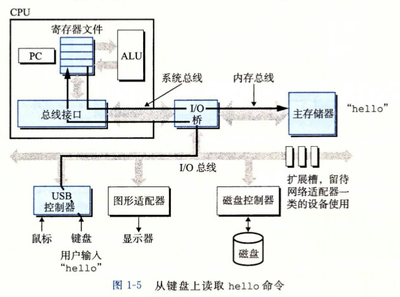
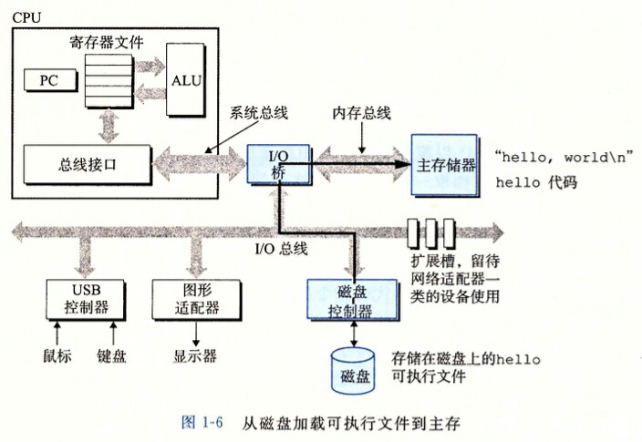
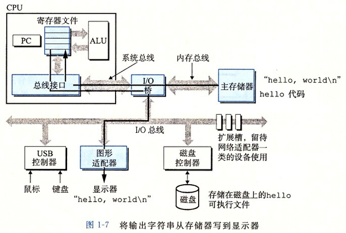
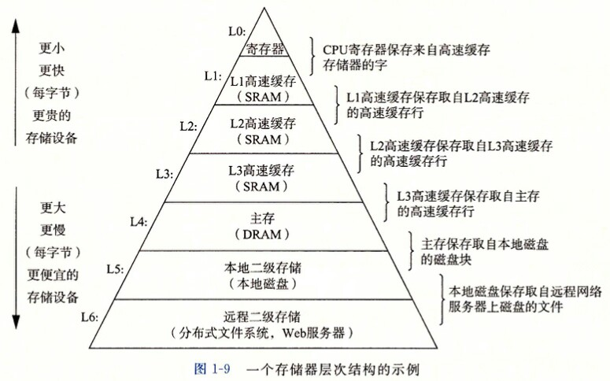
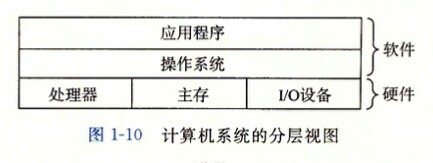
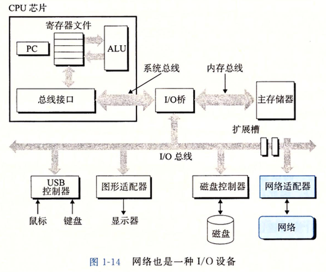
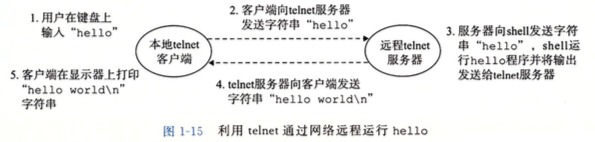

# 第1章 计算机系统漫游

**页码：1 ～ 20**

###1.1 信息就是位 + 上下文

**系统中的所有信息都是由bit串构成（明文->编码->底层 01），信息的解释取决于具体的 context**

### 1.2 程序被其他程序翻译成不同的格式

**C程序编译过程：预处理->编译->汇编->链接**

### 1.3 了解编译系统如何工作是大有益处的

**优化程序性能**

**理解链接时出现的错误**

**避免安全漏洞**

### 1.4 处理器读并解释储存在内存中的指令

​	此刻，hello.c 源程序已经被编译系统翻译成了可执行目标文件 hello，并被存放在磁盘里。想要在 Unix 系统上运行该可执行文件，我们将它的文件名输入到成为 shell 的应用程序中：

```shell
linux> ./hello
hello,world
linux>
```

​	shell 是一个命令解释器，它输出一个提示符，等待输入一个命令行，然后执行这个命令。如果该命令行的第一个单词不是一个内置的 shell 命令，那么 shell 就会假设这是一个可执行文件的名字，它将加载并运行这个文件。所以在此例中， shell 将加载并运行 hello 程序，然后等待程序终止。 hello 程序在屏幕上输出它的消息，然后终止。shell 随后输出一个提示符，等待下一个输入的命令行。

#### 1.4.1 系统的硬件组成

**1. 总线**

**2. I/O 设备**

**3. 主存**

**4. 处理器**

#### 1.4.2 运行 hello 程序







### 1.5 高速缓存至关重要

**系统花费了大量的时间把信息从一个地方挪到另一个地方**

### 1.6 存储设备形成层次结构



### 1.7 操作系统管理硬件

​	当 shell 加载和运行 hello 程序时，以及 hello 程序输出自己的消息时， shell 和 hello 程序都没有直接访问键盘、显示器、磁盘或者主存。取而代之的是，它们依靠操作系统提供的服务。我们可以把操作系统看成是应用程序和硬件之间插入的一层软件，如图 1-10 所示。所以应用程序对硬件的操作尝试都必须通过操作系统。



​	操作系统有两个基本功能：（1）防止硬件被失控的应用程序滥用；（2）向应用程序提供简单一致的机制来控制复杂而又通常大大不同的低级硬件设备。操作系统通过几个基本的抽象概念（进程、虚拟内存和文件）来实现这两个功能。如图 1-11 所示，文件是对 I/O 设备的抽象表示，虚拟内存是对主存和磁盘 I/O 设备的抽象表示，进程则是对处理器、主存和 I/O 设备的抽象表示。我们将依次讨论每种抽象表示。

#### 1.7.1 进程 && 1.7.2 线程 && 1.7.3 虚拟内存 && 1.7.4 文件

**页码：11 ～ 14 **

此部分主要看书上讲解

### 1.8 系统之间利用网络通信

**1. 网络也是一种 I/O 设备**

​	现代系统经常通过网络和其他系统连接到一起。从一个单独的系统来看，网络可视为一个 I/O 设备，如图 1-14 所示。当系统从主存复制一串字节到网络适配器时，数据流经过网络到达另一台机器，而不是比如说到达本地磁盘驱动器。相似地，系统可以读取从其他机器发送过来的数据，并把数据复制到自己的主存。



**2. 利用 telnet 通过网络远程运行 hello**



### 1.9 重要主题

#### 1.9.1 Amdahl 定律

​	当我们对系统的某个部分加速时，其对系统整体性能的影响取决于该部分的重要性和加速程度。若系统执行某应用程序需要时间为 𝑇𝑜 。假设系统某部分所需执行时间与该时间的比例为为 𝛼𝑇𝑜，现在所需时间为 (𝛼𝑇𝑜)/𝘬 。因此，总的执行时间为
$$
T_n = (1 - 𝛼)T_𝘰  + (𝛼T_o)/k = T_o [(1 - 𝛼) + 𝛼/k]
$$
​	由此，可以计算加速比
$$
S = \cfrac{1}{(1 - a) +a/k}
$$
​	Amdahl 定律一个有趣的特殊情况是考虑 𝘬 趋向于 ∞ 时的效果。这就意味着，我们可以取系统的某一部分将其加速到一个点，在这个点上，这部分花费的时间可以忽略不计。于是我们得到
$$
S_∞ = \cfrac{1}{(1 - a)}
$$

#### 1.9.2 并发和并行

#####1. 线程级并发 && 2. 指令级并行 && 3. 单指令、多指令并行

**页码：17 ～ 19**

此部分主要看书上讲解

#### 1.9.3 计算机系统中抽象的重要性

**页码：19 ～ 20**

此部分主要看书上讲解

### 1.10 小结

