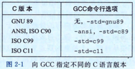
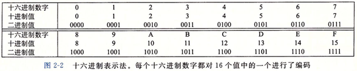
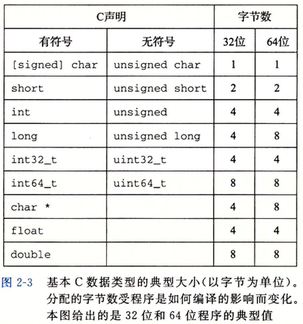

# 第2章 信息的表示和处理

根据 ISO C11 来编译程序 prog.c，我们就使用命令行：

```shell
linux> gcc -std=c11 prog.c
```

GNU 项目正在开发一个结合了 ISO C11 和其他一些特性的版本，可以通过命令行选项 -std=gnu11 来指定。（目前，这个实现还未完成。）今后，这个版本会成为默认的版本。



### 2.1 信息存储

#### 2.1.1 十六进制表示法



​	在 C 语言中，以 0x 或 0X 开头的数字常量被认为是十六进制的值。字符 ‘A’ ～ ‘F’ 既可以是大写，也可以是小写。

**二进制和十六进制**

​	二进制和十六进制之间的转换比较简单直接，因为可以一次执行一个十六进制数字的转换。数字的转换可以参考如图 2-2 所示的表。

​	例：将 0x173A4C 转换成二进制格式。

| 十六进制 |  1   |  7   |  3   |  A   |  4   |  C   |
| :--: | :--: | :--: | :--: | :--: | :--: | :--: |
| 二进制  | 0001 | 0111 | 0011 | 1010 | 0100 | 1100 |

​	反过来，如果给定一个二进制数字 1111001010110110110011，可以通过首先把它分为每 4 位一组来转为十六进制。

| 二进制  |  11  | 1100 | 1010 | 1101 | 1011 | 0011 |
| :--: | :--: | :--: | :--: | :--: | :--: | :--: |
| 十六进制 |  3   |  C   |  A   |  D   |  B   |  3   |

​	当值 x 是 2 的非负整数 n 次幂时，也就是 x = 2 ^ n，我们可以很容易地将 x 写成十六进制形式，只要记住 x 的二进制表示就是 1 后面跟 n 个 0.十六进制数字 0 代表 4 个二进制 0。所以，当 n 表示成 i + 4j 的形式，其中 0 ≤ i ≤ 3，我们可以把 x 写成开头的十六进制数字为 1(i = 0)、2(i = 1)、4(i = 2) 或者 8(i = 3)，后面跟随着 j 个十六进制的 0。

​	比如， x = 2048 = 2 ^ 11，我们有 n = 11 = 3 + 4 · 2，那么 i = 3，j = 2，从而得到十六进制表示 0x800。

**十进制和十六进制**

​	十进制和十六进制表示之间的转换需要使用乘法或者除法来处理一般情况。

​						314156 = 19634 · 16 + 12	(C)
​						  19634 = 1227 · 16 + 2	(2)
​						    1227 = 76 · 16 + 11		(B)
​							 76 = 4 · 16 + 12		(C)
​							   4 = 0 · 16 + 4		(4)

​	从这里，我们能读出十六进制表示为 0x4CB2C。

​	反过来，将一个十六进制数字转换为十进制数字，我们可以用相应的 16 的幂乘以每个十六进制数字。

​	比如，给定数字 0x7AF，我们计算她对应的十进制值为 7 · 16 ^ 2 + 10 · 16 + 15 = 1967

#### 2.1.2 字数据大小



#### 2.1.3 寻址和字节顺序

